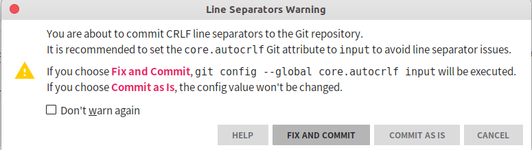

# git core.autocrlf配置说明

> <https://www.cnblogs.com/youpeng/p/11243871.html>

## 格式化

格式化是许多开发人员在协作时，特别是在跨平台情况下，遇到的令人头疼的细小问题。 由于编辑器的不同或者Windows程序员在跨平台项目中的文件行尾加入了回车换行符， 一些细微的空格变化会不经意地进入大家合作的工作或提交的补丁中。不用怕，Git的一些配置选项会帮助你解决这些问题。

## core.autocrlf

假如你正在Windows上写程序，又或者你正在和其他人合作，他们在Windows上编程，而你却在其他系统上，在这些情况下，你可能会遇到行尾 结束符问题。 这是因为Windows使用回车和换行两个字符来结束一行，而Mac和Linux只使用换行一个字符。 虽然这是小问题，但它会极大地扰乱跨平台协作。

**在Windows平台上**，git默认的core.autocrlf是true，可以通过`git config --list`命令查看。

Git可以在你提交时自动地把行结束符CRLF转换成LF，而在签出代码时把LF转换成CRLF。用core.autocrlf来打开此项功能， 如果是在Windows系统上，把它设置成true（默认配置），这样当签出代码时，LF会被转换成CRLF：

`git config --global core.autocrlf true`

Linux或Mac系统使用LF作为行结束符，因此你不想Git在签出文件时进行自动的转换；当一个以CRLF为行结束符的文件不小心被引入时你肯定想进行修正， 把core.autocrlf设置成input来告诉Git在提交时把CRLF转换成LF，签出时不转换：

`git config --global core.autocrlf input`
这样会在Windows系统上的签出文件中保留CRLF，会在Mac和Linux系统上，包括仓库中保留LF。

如果你是Windows程序员，且正在开发仅运行在Windows上的项目，可以设置false取消此功能，把回车符记录在库中：

`git config --global core.autocrlf false`
关于在IDEA中的提示，如下图所示，点击FIX AND COMMIT即可。
  
