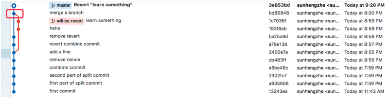

# revert

## 一、使用

revert是用来恢复一些修改的。`git revert`命令是用来还原一些操作，是一个撤销类型的命令。但它不是一个传统的撤销命令，因为整个过程中不会删除任何数据；相反，它将创建一个具有相反改动的新提交，从而撤销掉指定的提交。本质上看，`git revert`是一个新的提交。

## 二、 选项

`git revert`允许附带一些额外的操作，比如编辑、不编辑、清理等等。

```bash
# <commit>: commit选项是用来恢复一个提交的。要恢复一个提交，我们需要commit参考ID。从git log 命令可以找到commit id。
git revert <commit-ish>

# <--edit>:它用于在还原提交之前，编辑commit信息。是git revert命令的一个默认选项。
git revert -e <commit-ish>

# -m parent-number /--mainline parent-number：这个选项用来revert merge的结果。一般来说，我们不能revert一个merge，因为我们不知道哪一边的合并应该被认为是主线。我们可以指定父级编号，并允许revert来逆转相对于指定的父级的变化。

# -n/--no edit：这个选项不会打开文本编辑器。它将直接恢复上次的提交。
git revert -n <commit-id>

# --cleanup=<mode>:这个清理选项决定了如何从信息中去除空格和注释。

# -n/--no-commit:一般来说，revert命令默认都会提交。no-commit选项将不会自动提交。此外，如果使用这个选项，你的索引不必与HEAD的提交相匹配。no-commit选项有利于连续恢复对你的索引有影响的多个提交。

# 反做多个commit-id
git revert -n commit-idA..commit-idB

# 合并冲突后退出
git revert --abort

# 合并后退出，但是保留变化
git revert --quit

# 合并后解决冲突，继续操作，如果遇到冲突可以修改冲突，然后重新提交相关信息
git add .
git commit -m "提交的信息"
```

## 三、理解

### 1. 直观理解

```bash
假如git commit 链是

A -> B -> C -> D

如果想把B，C，D都给revert，除了一个一个revert之外，还可以使用range revert

git revert B^…D

这样就把B,C,D都给revert了，变成：

A-> B ->C -> D -> D’-> C’ -> B’

用法就是：

git revert OLDER_COMMIT^…NEWER_COMMIT

如果我们想把这三个revert不自动生成三个新的commit，而是用一个commit完成，可以这样：

git revert -n OLDER_COMMIT^…NEWER_COMMIT
git commit -m “revert OLDER_COMMIT to NEWER_COMMIT”
```

### 2. 冲突解决方式

当讨论 revert 时，需要分**两种情况**，因为 commit 分为两种：一种是常规的 commit，也就是使用 `git commit` 提交的 commit；另一种是 merge commit，在使用 `git merge` 合并两个分支之后，你将会得到一个新的 merge commit

merge commit 和普通 commit 的不同之处在于 merge commit 包含两个 parent commit，代表该 merge commit 是从哪两个 commit 合并过来的。



在上图所示的红框中有一个 merge commit，使用 `git show` 命令可以查看 commit 的详细信息

```bash
git show bd86846
commit bd868465569400a6b9408050643e5949e8f2b8f5
Merge: ba25a9d 1c7036f
```

这代表该 merge commit 是从 ba25a9d 和 1c7036f 两个 commit 合并过来的。

而常规的 commit 则没有 Merge 行

```bash
git show 3e853bd
commit 3e853bdcb2d8ce45be87d4f902c0ff6ad00f240a
```

**revert 常规 commit**

使用 `git revert <commit id>` 即可，git 会生成一个新的 commit，将指定的 commit 内容从当前分支上撤除。

**revert merge commit**

revert merge commit 有一些不同，这时需要添加 -m 选项以代表这次 revert 的是一个 merge commit

但如果直接使用 `git revert <commit id>`，git 也不知道到底要撤除哪一条分支上的内容，这时需要指定一个 parent number 标识出"主线"，主线的内容将会保留，而另一条分支的内容将被 revert。

如上面的例子中，从 `git show` 命令的结果中可以看到，merge commit 的 parent 分别为 ba25a9d 和 1c7036f，其中 ba25a9d 代表 master 分支（从图中可以看出），1c7036f 代表 will-be-revert 分支。需要注意的是 -m 选项接收的参数是一个数字，数字取值为 1 和 2，也就是 Merge 行里面列出来的第一个还是第二个。

保留主分支，应该设置主分支为主线，操作如下：

```bash
git revert -m 1 bd86846
```

**revert 之后重新上线**
假设tom在自己分支 tom/feature 上开发了一个功能，并合并到了 master 上，之后 master 上又提交了一个修改 h，这时提交历史如下：

```bash
a -> b -> c -> f -- g -> h (master)
           \      /
            d -> e   (tom/feature)
```

突然，发现tom的分支存在严重的 bug，需要 revert 掉，于是大家把 g 这个 merge commit revert 掉了，记为 G，如下：

```bash
a -> b -> c -> f -- g -> h -> G (master)
           \      /
            d -> e   (tom/feature)
```

然后tom回到自己的分支进行 bugfix，修好之后想重新合并到 master，直觉上只需要再 merge 到 master 即可，像这样：

```bash
a -> b -> c -> f -- g -> h -> G -> i (master)
           \      /               /
            d -> e -> j -> k ----    (tom/feature)
```

i 是新的 merge commit。但需要注意的是，这 **不能** 得到我们期望的结果。因为 d 和 e 两个提交曾经被丢弃过，如此合并到 master 的代码，并不会重新包含 d 和 e 两个提交的内容，相当于只有 goudan/a-cool-feature 上的新 commit 被合并了进来，而 goudan/a-cool-feature 分支之前的内容，依然是被 revert 掉了。

所以，如果想恢复整个 tom/feature 所做的修改，应该先把 G revert 掉：

```bash
a -> b -> c -> f -- g -> h -> G -> G' -> i (master)
           \      /                     /
            d -> e -> j -> k ----------    (tom/feature)
```

其中 G’ 是对 G 的 revert 操作生成的 commit，把之前撤销合并时丢弃的代码恢复了回来，然后再把tom的分支merge到master分支上，把解决 bug 写的新代码合并到 master 分支。

## 四、`git revert` 和 `git reset`的区别

git revert是用一次新的commit来回滚之前的commit，git reset是直接删除指定的commit。

1. 在回滚这一操作上看，效果差不多。但是在日后继续merge以前的老版本时有区别。因为git revert是用一次逆向的commit“中和”之前的提交，因此日后合并老的branch时，导致这部分改变不会再次出现，但是git reset是之间把某些commit在某个branch上删除，因而和老的branch再次merge时，这些被回滚的commit应该还会被引入。
2. git reset 是把HEAD向后移动了一下，而git revert是HEAD继续前进，只是新的commit的内容和要revert的内容正好相反，能够抵消要被revert的内容。

### 图示对比

```bash
# git revert 后的合并
老分支: A -> B -> C
主分支: A -> B -> C -> revert(C)  
合并结果: A -> B -> C -> revert(C)  # C 的变更不会再次出现

# git reset 后的合并
老分支: A -> B -> C
主分支: A -> B                    (reset 删除了 C)
合并结果: A -> B -> C              # C 的变更重新引入！
```

## 五、总结

- git revert 是“安全模式”，适合团队协作，避免未来合并冲突。
- git reset 是“暴力模式”，仅限本地操作，可能导致历史混乱。
- 记住：公共分支永远用 revert，本地分支可酌情用 reset。


> <https://blog.csdn.net/allanGold/article/details/111372750>
