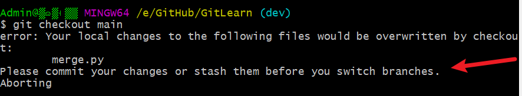

# 切换分支

- 当前一个分支上修改文件或目录后，在没有提交前，任何一个分支的状态(git status)都会同步为一样
- 合并或切换分支工作，一定是在当前分支提交后，或者使用git stash将当前暂存区状态保存下来之后进行，即当前分支git status显示为干净的仓库再切换
- 同时修改了同一个工作区相同文件，由于Git管理版本是通过移动HEAD指针，工作区的修改对于移动到不同分支的指针是一样的。此时master和dev分支git add添加到暂存区，git status在不同分支状态是一样的，如果master分支先commit，中间所做的修改，会全部算作master的修改（由于dev没有提交，仅仅add添加了暂存区，中间的修改在切换分支提交后会在dev分支丢失，但所有修改都存在于master的提交中）。故：实际开发中一定要提交或者暂存当前暂存区的状态后，再切换分支进行其他修改，否则在本分支所做修改的状态会丢失。
